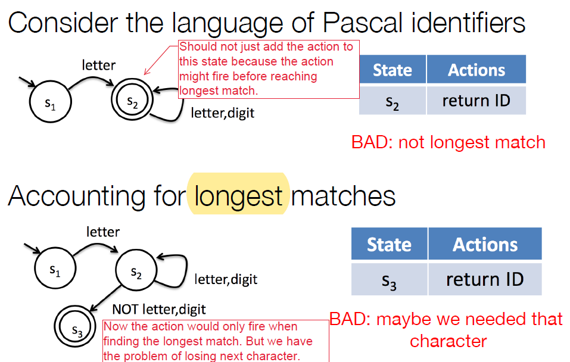

# Scanner

Job: translate sequence of characters into sequence of tokens. Each time a scanner is called, it should return the **longest** sequence of characters corresponding to that token.  

Normally *scanner generator* is used to generate scanner code. Requirements: regular expression for each token, and regular expressions for things to ignore. 


## Finite State Machine (FSM)

- Input: sequence of characters 
  Output: Accept/Reject. If a string is accepted by FSM *M*, be say it's in *L(M)* (language of M).

  

- FSM mechanism

  ```
  curr_state = start_state
  let input_char = current input char
  repeat
    if (there is an edge from curr_state with label input_char into next_state)
      curr_state = next_state
      input_char = next input char
    else
      error
  until (input string is consumed or error)
  The string is accepted if the entire string is consumed
  ```

- FSM formal representation

  (Q, Σ, δ, q, F)

  Q: finite set of states

  Σ: the set of alphabets

  δ: transition function: Q x Σ -> Q. (An element of Q) x (An element of Σ) -> (An element of Q)

  q: start state

  F: final states, a subset of Q

  An string `x1x2x3...xn` is accepted if `δ(...δ(δ(δ(q, x1), x2), x3)..., xn)` is an element of F.

  In implementation, δ is ususally implemented as a table (`transition` in the code below):

  ```
  curr_state = start_state
  done = false
  while (!done)
    ch = nextChar()
    next_state = transition[curr_state][ch]
    if (ch == EOF || next_state == error)
      done = true
    else
      curr_state = next_state
  return final_states.contains(curr_state) && next != error
  ```

- FSM is also called Finate Automata (FA). FSM types: DFA and NFA. 

  Pros and cons: NFA is more compact, while DFA is effiicient to implement with transition table.


## Deterministic FA (DFA)

No state has >1 outgoing edges with the same label. (But each state can have outgoing edges with different labels!)

The above formal representation for FSM is actually for DFA. (**One** state) x (**One** char) -> (**One** state).


## Non-deterministic FA (NFA)

- Each state can have multiple outgoing edges with the same label. Edges might be labelled with ɛ (empty string).

- NFA formal representation

  (Q, Σ, δ, q, F)

  Q: finite set of states

  Σ: the set of alphabets

  δ: transition function: Q x Σ -> **2^Q**. (An element of Q) x (An element of Σ) -> (An element of **the power set of Q**)

  q: start state

  F: final states, a subset of Q

  The formal representation for NFA is almost the same as DFA, except for the transition function δ. 

  To check if string is in L(M), simulate the set of choices M can take. The string is accepted if one sequence of transitions (1) consumes the entire string; and (2) ends in one of the final states. 

- Automata equivalence: two automata M and M' are equivalent iff L(M) and L(M').

- NFA and DFA are equivalent. 

  Lemma1: Given a DFA, an equivalent NFA can be contructed. This's trivial.

  Lemma2: Given an NFA, an equivalent DFA can be constructed. Idea: the total number of states the NFA can be in is finite (the power set!). Each state in NFA is a collection of states in DFA. 

- NFA -> DFA

  1. NFA with ɛ -> NFA without ɛ
  2. NFA without ɛ -> DFA

  

## Regular Expression and Regular Language

- Regular language: any language that can be described by an FSM.

- Regular expression: patterns describing regular languages.
  - Notations: alternation `|`, concatenation `.`, iteration `*` and `+`.
  - Input to scanner-generator. 
  
- Regexp -> NFA: Rules for `|`, `.`, and `*`.

  Now we have: **Regex == NFA == DFA**

- Scanner generator components
  - Token -> regexp (provided by us)
  - regexp -> NFA
  - NFA -> DFA
  - DFA -> code


## FSM for tokenization

- What we have now: Regexp -> DFA. 

  What else is needed for tokenization: (1) Actions: FSM should be able to return current token. It also needs to be able to put back characters (see picture below) (2) After returning one token, FSM should restart on remaining string. 

  

  

  With this, each element in the transition table can be (1) another state, or (2) some action.

  ```
  do {
  	read char;
  	perform action / update state;
  	if (action is to return a token) {
  		restart in start state;
  	}
  } while (not EOF or stuck);
  ```

  

  ## Scanner Summary
  
  - FSM: DFA and NFA.
  - Regular expression and regular language.
  - Regexp == NFA == DFA (Regexp -> NFA, NFA -> DFA)
  - Use FSM for tokenization
  - Scanner generator (regexp + regexp->NFA + NFA->DFA + DFA->code)