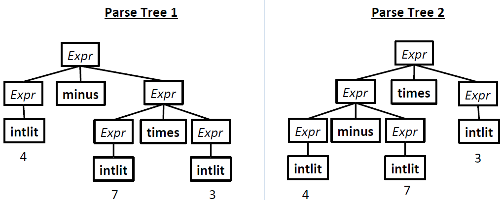
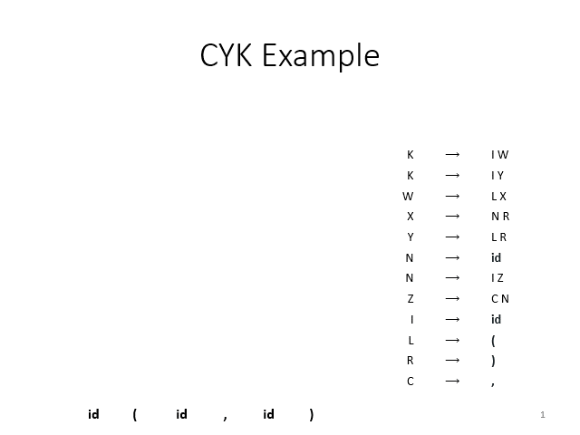

# Parser

- Input: sequence of tokens from scanner

  Output: Abstract Syntax Tree (AST)

- Problem with RegExp

  1. RegExp cannot handling matching (e.g., balanced parenthesis). A FSM can track only finitely many states.
  2. RegExp cannot capture the structure of operations (associativity, precedence).

  Solution: Context Free Grammar (CFG).


## Context Free Grammar

- A set of recursive rules (called "product rules") capturing patterns of strings. 

- CFG formal representation

  (N, Σ, P, S)

  N: set of *non-terminals* (internal nodes in the parse tree)

  Σ: set of *terminals* (leaf nodes in the parse tree)

  P: set of product rules (a.k.a productions)

  S: the initial non-terminal symbol, an element in N

- Product rule syntax: `LHS -> RHS`

- String derivation

  To derive a string from product rules, do the following:

  ```
  current_sequence = start symbol
  repeat
  	Find a non-terminal X in the current sequence
  	Find a production rule X->α
  	replace X with α in current_sequence
  until there're no more non-temrinals
  ```

  Derivation syntax: `=>` means "derives". `=>+` means "derives in >= 1 step". `=>*` means "derives in >= 0 step".

  Let G = (N, Σ, P, S), L(G) = { w | S =>+ w }, where S is the start nonterimnal, w is 𝜀 or a sequence of terminals.

  CFG product rules define the *syntax* of a language.


## Ambiguity

- Recursion in Grammar

  - A grammar is *recursive* in X if X =>+ αXγ, for non-empty α and γ;
  - A grammar is *left-recursive* in X if X =>+ Xγ, for non-empty γ;
  - A grammar is *right-recursive* in X if X =>+ αX, for non-empty α.

  We can take left-recursive as left-associative, and right-recursive as right-associative.

- Ambiguity grammar example: *associativity*

  ```
  Prog 	-> begin Stmts end
  Stmts 	-> ...
  Stmt  	-> id assign Expr
  Expr	-> id
           |  Expr plus id
           |  num
  ```

  Left-recursive: `Stmts -> Stmts semicolon Stmt | Stmt`. Not ambiguous.

  Right-recurisive: `Stmts -> Stmt semicolon Stmts | Stmt`. Not ambiguous.

  Recursive: `Stmts -> Stmts semicolon Stmts | Stmt`. Ambiguous. It cannot handle `a = 1; b = 2; c =3;` without ambiguity. 

  Can we introduce *derivation order*? 

  Leftmost derivation: always expand the leftmost nonterminal.

  Rightmost derivation: always expand the rightmost nonterminal.

  The last production rule is ambiguous in associativity, even with derivation order. 

  For grammer G and string w, G is ambiguous if:

  - more than one leftmost derivation of w;
  - more than one rightmost derivation of w;
  - more than one parse tree of w.

  The 3 rules above are equivalent to each other. If one is correct, all three are correct 

- Ambiguious grammar example: *precedence*

  ```
  Expr	-> intlit
  		|  Expr minus Expr
  		|  Expr times Expr
  		|  lparen Expr rparen
  ```

  Note that we don't have to use the `Expr minus Expr` before `Expr times Expr`. So there can be two parsing results for `4 - 7 * 3`: 

  

  


## Resolving Ambiguity

- Precedence

  - One nonterminal per *precedence level* (e.g., `+` and `-` is one level, `*` and `/` is another level)
  - Parse lowest level first

  ```
  Expr	-> intlit
  		|  Expr minus Expr
  		|  Expr times Expr
  		|  lparen Expr rparen
  ```

  becomes

  ```
  Expr 	-> Expr minus Expr
  		|  Term
  Term	-> Term times Term
  		|  Factor
  Factor	-> intlit
  		| Paren
  Paren	-> lparen Expr rparen
  ```

  or, shorter

  ```
  Expr 	-> Expr minus Expr
  		|  Term
  Term	-> Term times Term
  		|  Factor
  Factor	-> intlit
  		| lparen Expr rparen
  ```

  In this way, higher-precedence operations appears lower in the tree. As we evaulate in a bottom-up way, higher-precedence operations are evaluated earlier. 

- Associativy

  The above grammar is still ambiguous in associativity, e.g. `1-2-3`. Problem: recursive, like `Expr -> Expr minus Expr`. 

  Solution: Define left-associative operations in left-recursive productions, right-associative operations in right-recursive productions.

  ```
  Expr 	-> Expr minus Expr
           |  Term
  Term	-> Term times Term
  		|  Factor
  Factor	-> intlit
  		| lparen Expr rparen
  ```

  becomes

  ```
  Expr 	-> Expr minus Term
  		|  Term
  Term	-> Term times Factor
  		|  Factor
  Factor	-> intlit
  		| lparen Expr rparen
  ```


## Syntax Directed Translation (SDT)

So far, we have

- CFG for language *definition*: G -> L(G)
- CFG for language *recognition*: Given string w, is w in L(G)?
- CFG for language *translation*: Given string w, if w is in L(G), create a parse tree. 

However, parse tree is not good enough yet. Parse tree is also called "concrete syntax tree". As shown in the pictures below, parse tree retains all information about the input and grammar, including parenthesis, brackets, etc. In other words, parse tree represents the structure (e.g., associativy, precedence) of the syntax, but with noisy details. To remove those unnecessary noise and focus on the abstract relationship, we generate "abstract syntax tree" (AST) from parse tree. [Difference between parse tree and AST](https://stackoverflow.com/q/5026517).


In short, AST is more condensed and usually easier to work with. AST has operands as leafs and operators as internal nodes. 

Syntax Directed Translation: consume a parse tree with actions, by augmenting CFG productions with *translation rules*. The output could be string, integer, AST, etc. When AST is the output, the process is called "parsing".

**Note**: the previous discussion assumes that a parse tree has already been generated (and we didn't care how this's done). In practice, parse tree is not generated. We combine "syntax -> parse tree -> AST" into one step "syntax -> AST" using certain parsing algorithm (more on this later). Moreover, we don't worry about the implementation of the parsing algorithm. The *parser generator* takes care of this. Read about LL(1) below.


## Bottom-up Parsing Algorithm: CYK

- Operates in O(n^3) time, works bottom-up, only takes grammar in Chomsky Normal Form

- Chomsky Normal Form

  All rules must be one of the two forms:

  ```
  X -> t
  X -> A B
  ```

  Also, `X -> ε` is not allowed, unless X is the start symbol. To use CYK, you must re-write the grammar into Chomsky Normal Form. This means the parse tree would looks different, though the language of the grammar would be the same. 

  The fact that non-nullable non-terminals come in pairs means that: 

  - Each subtree is a subspan of the input string and the tree is a **binary tree**
  - Each subspan has at least one character

  So `X -> t` forms the leaf nodes, while `X -> A B` forms the internal nodes. 

- Run the CYK algorithm

  

  There're in total O(n^2) cells, each cell takes O(n) time. For example, to see if there's any match for cell (x, y), you need to check the following pairs {(x, x), (x+1, y)}, ..., {(x, y-1), (y, y)}, in total (y-x) checks. 

  If we found match for the top cell (representing entire string), the source program is in the language of the grammar. If we found more than one match, the grammar is ambiguous. 

- Eliminate Useless Nonterminals

  We can avoid useless work if we eliminate nonterminals. Two rules:

  - If a nonterminal cannot derive a sequence of terminal symbols (in some steps), then it's useless.
  - If a nonterminal cannot be derived fromt the start sumbol, then it's useless. 

- Convert to Chomsky Normal Form

  1. Eliminate epsilon rules
  2. Eliminate unit rules (productions with only one nonterminal on the RHS)
  3. Fix productions with terminals on RHS
  4. Fix productions with > 2 nonterminals on RHS

- CYK parses **arbritary** CFG in O(n^3) time in a bottom-up way. It works for ambiguous grammar as if finds all possible parse trees! However, it's too slow and is not used in our parsing generator. See LL(1) below. 


## Top-down Parsing Algorithm for LL(1) Grammar

- Top-down parser: also called "predictive parser". Instead of generating all possible parse tree like CYK, repeatedly "predicts" what production to use. This requires addtional restriction on the grammar.

- Predictive parser components:

  Token stream from scanner, Selector table (columns being terminals, rows being nonterminals), work stack.

- Algorithm (for determining if a string can be accepted)

  ```
  stack.push(eof)
  stack.push(start nonterminal)
  t = scanner.getToken()
  repeat
    	if stack.top() is a terminal y
    		match y with t
    		pop y from the stack
    		t = scanner.getToken()
    	else if stack.top() is a nonterminal X
    		production = table[X][t]
    		pop X from the stack
    		push production's RHS to stack, from right to left
  until one of the following:
  	stack is empty (accept)
  	stack.top() is a terminal that doesn't match t (reject)
  	stack.top() is a non-term and parse table entry is empty (reject)
  ```

  Note that this algorithm **doesn't generate AST**, but only determines if the string is accepted. 

  The work stack contains symbols the parser expects to find, based on the prediction rules in selector table. The predictive parser only requires one token of lookahead.

  The algorithm works well in O(n) if we can solve two core issues:

  1. How to know if a grammar is LL(1)?
  2. How to build the selector table?

  Answer to both: if each cell in the selector table has <= 1 production, the grammar is LL(1).

- LL(1) grammar transformations

  Necessary (but not sufficient) conditions: (1) no left-recursion; (2) left-factored.

  - Why left-recusion is a problem

    Consider left-recursive grammar `XList -> XList x | x`, which captures a list of x's. When seeing one 'x', we don't know which option to use. If we choose `XList -> x`, we are wrong if there're more x's. If we choose `XList -> XList x`, we are wrong if there're no more x. So we cannot be sure to make correct decision without further information.

  - Why left-factored is required

    If a nonterminal has two productions whose RHS have common prefix, the grammar is not left-factored.

  We can eliminate left-recursion and make the grammar left-factored. But this's doesn't guarantee the grammar as LL(1).

- Build selector table (parse table)

  If more than one production in any cell, the grammar is not LL(1).

- Implement SDT for LL(1) Parser

  Previously we said that SDT takes parse tree and generates AST bottom-up. LL(1) parser doesn't explicitly build the parse tree, but implicitly track it with stack. So during parsing, we track parse tree (using *semantic stack*) implicitly and builds AST directly.

  The LL(1) algorithm shown above doesn't generate AST, so here we add translation rules to get AST. In previous discussion, translation rules get information from parse tree nodes and return computed translation result. For LL(1) parser, we get/return information using the semantic stack. In particular, we pop translation of RHS nonterminals from the stack, and push computed translation result of LHS to the stack. Those push/pop actions are defined with action numbers and put on the symbol stack, and can appear in the product rule.

  For terminals, we need to push its value onto the stack. So we put the action number before the symbol. In short, action numbers go **after** nonterminals, but **before** terminals. 

  Note that the item pushed to/poped from the semantic stack are AST nodes. In this way, we get AST as output of LL(1) parsing.

  

## Parser Summary

- CFG
- Resolving ambiguity for precedence and associativity
- SDT general concept
- Bottom-up parsing: CYK, Chomsky Normal Form
- Top-down parsing: LL(1) parsing
  - Necessary condition for LL(1) grammar
  - Build selector table
  - Implementation: LL(1) grammar transformation, build selector table, work stack, action & action number, semantic stack


## Implementation Summary

- Scanner

  Language abstracton: RegExp

  Output: token stream

  Tool: JLex (scanner generator), with RegExp as input

  Implementation: DFA walking via table. 

  Check `P2/`: `wumbo.jlex`, mainly about RegExp.

- Parser

  Language abstraction: CFG

  Output: AST

  Tool: Java CUP (parser generator), with CFG + actions as input

  Implementation: Build AST with translation rules
  
  Check `P3/`: `Wumbo.cup` (grammar and translation rules), and `ast.java` (AST node definitions and `unparse()`, to validate the correctness of AST).


