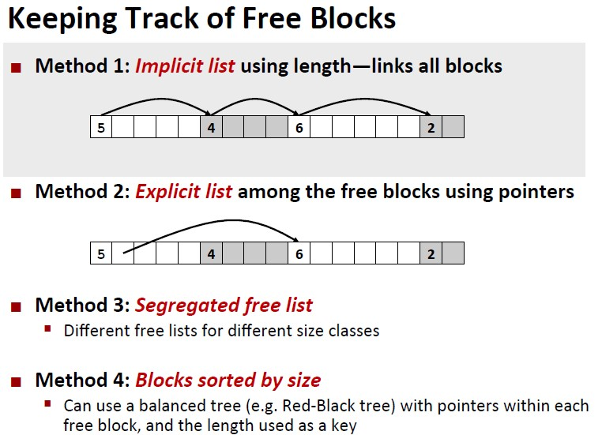

Goal: maximuze **throughput** and **peak memory utilization**

Internal fragmentation and external fragmentation.

#### Implicit list

Note that the **payload** is aligned, instead of the header.

Fit policy: first fit, next fit, best fit, worst fit.

Boundary tag introduced to help coalescing.

 

#### Explicit list

#### Segregated list

