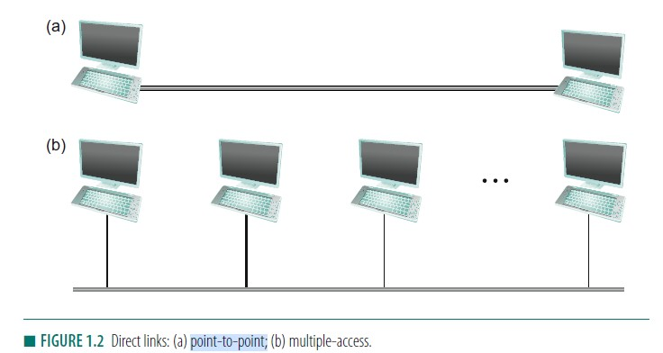

- LAN communication
    
    - point-to-point communication  
        Life is easy.
    - Multiple-access  
        Problem: different hosts want to send at the same time and each becomes a noise source for the others.  
        Solution: **Media Access Control (MAC)**.

    Side note: nowadays, mostly widely used MACs are Ethernet and WiFi. 

## Basic MAC types
- Channel partitioning
    - time division multiplexing (inefficient)
    - frequency division multiplexing (dividing bandwidths, inefficient)  
    - code division multiple access (CDMA): encoding bits differently for different hosts

- Taking turns 
    There's an "authority" in the LAN that decides which system gets access to the channel.
    
    - Polling 
        A local host polls other systems for access to the channel. Polling is more efficient than TDM.
    - Token passing 
    Hosts pass a bit sequence that enables them to send if they have it.  
    
The difference between channel-partitioning and taking-turns: In TDM, the host with nothing to send still gets its allocated slot, but in taking-turns, a host with nothing to send would be immediately passed.  
    
In a network where only a small number of hosts need to communicate, taking-turns would be much more efficient than channel partitioning; In a network where everybody wants to constantly communicate, there's not much difference.  
    
- Random Access 
    No coordination between senders. 
    Random MAC protocols need to manage contention: some strategy to resolve contention (determine ordering).  

    Carrier-sense: listen to the channel to see if someone else if using the channel.

    - Aloha protocol
        ```
        Any host can transmit for a fixed amount of time T (No carrier-sense).  
        A receiver transmits an acknowledgement(ACK) to the sender when receives a message.  
        If the sender doesn't receive an ACK within certain period of time, it resends the message.  
        If 2 hosts send simultaneously, use Random Exponential Backoff.
        ```
        
    - Ethernet protocol (in `2-20.md`)


​        

