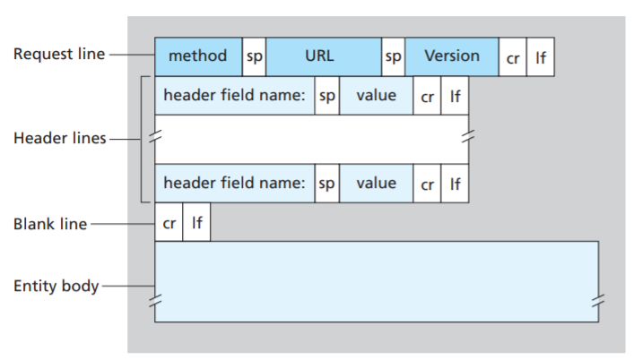
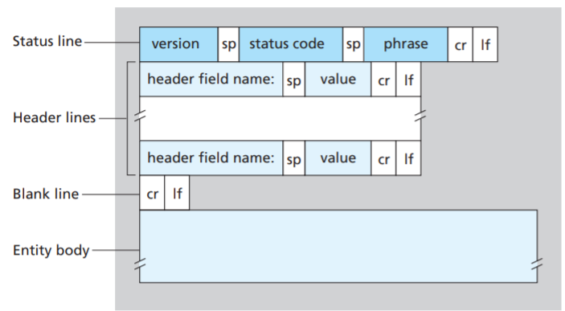
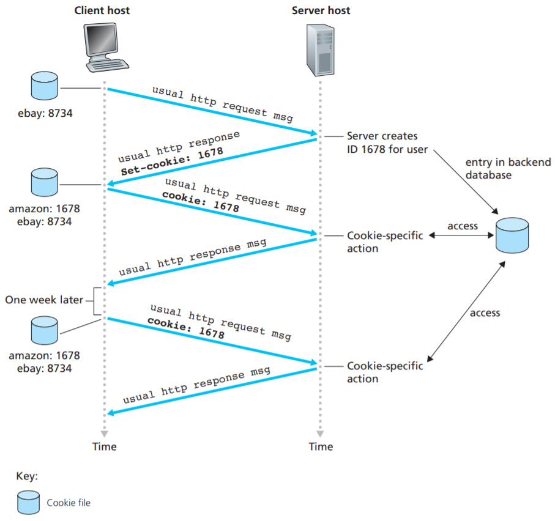
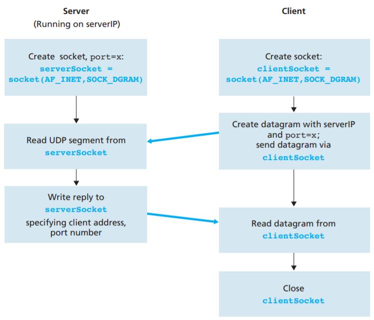
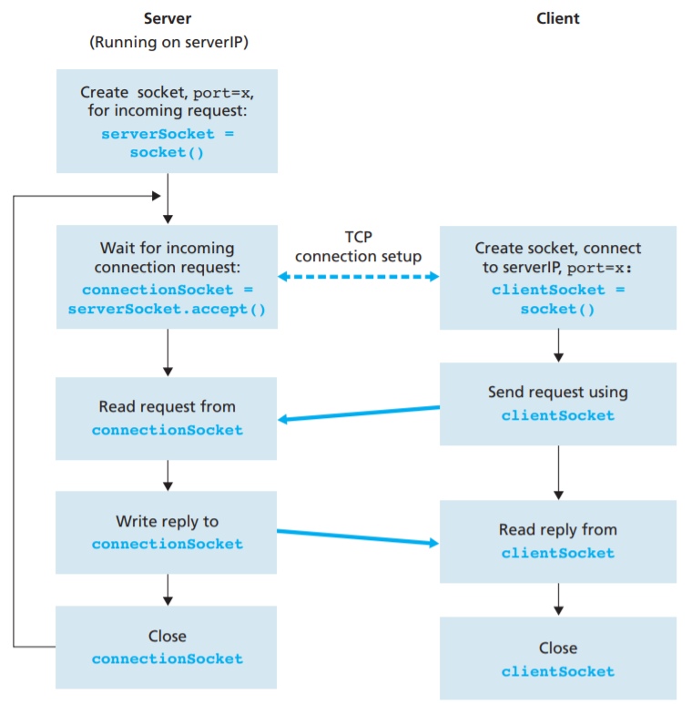

The content is from Chapter 2 of *Computer Networking: a top-down approach*, except for DNS.

# Application Layer

- Application model: (1) client-server; (2) peer-to-peer. 
- Hyper Text Transfer Protocol (HTTP) relies on TCP. 


## Priniciples of Network Applications

Applications run at application layer, utlizing services provided by network-core devices (routers, switches, etc.), but cannot control those network-core devices. 

Application architecture: client-server, peer-to-peer (P2P). Note that no matter in client-server model or P2P model, we have one **client process** and a **server process** for each pair of communicating process. The process that initiates the communication is labeled as client, while the process waiting to be contacted is the server. 

A **socket** is the interface between application layer and the transport layer. The application developer has full control of things on the application-layer side, but little control over the transport-layer side except for (1) transport layer protocols, and (2) some parameters. A socket's address is the <IP address, port number> pair. In other words, a process in networking communication is addressed by (1) the IP address of the receiver, and (2) a port number. 


## HTTP

### HTTP Overview

HyperText Transfer Protocol (HTTP) is implemented in two programs: a client program and a server program. The client program and server program talk to each other with HTTP messages. HTTP defines the structure of HTTP messages and how client & server interact with each other. 

HTTP uses TCP as transport protocol. The HTTP client initiates a TCP connection with the server. Once established, the client and the server processes access TCP through socket interface (e.g. sending/receiving HTTP message). 

Note that HTTP is a stateless protocol: the server serves request without storing any state information about the client. 


### Non-persistent and Persistent Connections

When client-server interactions take place over TCP, the application developer decides if each request/response pair be sent over a *separate* TCP connection, or all requests and responses be sent over the *same* TCP connection. In the first approach, the application uses **non-persistent connections**, and in the latter approach, **persistent connections**. We examine the advantages and disadvantages of the two approaches, using HTTP. Consider requesting `http://www.foo.com/bar/baz.index`.

HTTP with non-persistent connection: 

1. The HTTP client process initiates TCP connection to server `http://www.foo.com` on part 80. A socket is created at the client and another socket is created at server. 
2. The HTTP clients sends request to server via its socket, including path name `/bar/baz.com`.
3. The HTTP server receives request from socket, retrieves the object `/bar/baz.com` from its storage, encapsulates in HTTP response message, and sends to client via socket. 
4. The HTTP server process tells TCP to close the connection. 
5. The HTTP client receives the response message. The TCP connection terminates. The message indicates the encapsulated object is an HTML file, so the client extracts the file, examines the HTML file, and finds references to 10 JPEG files.
6. The first four steps are repeated for each of the 10 JPEG objects. 

We see that each TCP connection transports exactly one request message and one response message, for exactly one object. In the above example, 10 TCP connections can be serial or parallel, by configuration. Consider the 3-way handshake for TCP connection establishment, the response time for retrieving the HTML file is 2 RTTs. 

The disadvantages of non-persistent connection: (1) new connection for each request object can be inefficient, as each connections requires system resources like TCP buffer, TCP variables, etc, and (2) each object requires 2-RTT delivery time. 

With persistent connections, the server leaves the TCP connection open after sending a response. Subsequent request/response between the *same* client and server can be sent over the same connection. In particular, an entire web page can be sent over one connection. Moreever, multiple web pages on the same server can be sent from the server to the same client over a single persistent TCP connection. The server may close the connection when it's not used after some time. 


### HTTP message format

- Request Message

  ```
  GET /somedir/page.html HTTP/1.1
  Host: www.someschool.edu
  Connection: close
  User-agent: Mozilla/5.0
  Accept-language: fr
  
  ```

  The message is in ASCII text, to be human-readable.

  Each line terminates with `\r\n` (Carrige Return + Line Feed). The last line followed by an addition `\r\n`.

  The first line is called **request line**, and subsequent lines are called **header lines**. 

  The request line has 3 fields: method, URL, and HTTP version. The method field can be GET, POST, HEAD, PUT, DELETE. Most of HTTP request messages use GET. 

  The browser uses `Connection: close` to tell server to close the connection after sending the requested object. 

  

  The entity body is empty for GET, but used by POST. The HTTP client can use POST to fill out a form. With POST, the client is still requesting a web page, but the content depends on what the user entered into the form. Note that POST is not the only HTTP method to fill a form. HTML forms often use GET method and include the inputted data in the requested URL. 

  The PUT method allows a user to upload an object to a specific path on a web server. The DELETE method allows a user to delete an object on a Web server. 

- Response Message

  ```
  HTTP/1.1 200 OK
  Connection: close
  Date: Tue, 09 Aug 2011 15:44:04 GMT
  Server: Apache/2.2.3 (CentOS)
  Last-Modified: Tue, 09 Aug 2011 15:11:03 GMT
  Content-Length: 6821
  Content-Type: text/html
  (data data data data data ...)
  
  ```

  The response message has 3 sections: **status line**, **header lines**, and **entity body**. 

  The status line has three fields: HTTP version, status code, and status message. 

  The header lines are similar to HTTP request. `Connection: close` tells client that it's going to close the connection after sending the message. The `Date: ` header indicates the time when the HTTP response was created. The `Last-Modified` is when the object was created or last modified, which is critical for object caching both in the local client and in proxy servers. 

  The entity body is the requested object itself (`data data ... data`). 

  


## HTTP Cookies

HTTP server is stateless. This simplifies server design and enables high-performace web servers. However, websites often needs to identify users and thus Cookies are used. 

Cookie technology has four components: (1) a cookie header line in the HTTP response message; (2) a cookie header line in the HTTP request message; (3) a cookie file kept on the user's end system and managed by the user's browser; (4) a backend database at the website. 

 

Suppose the user has already visited eBay site before, and now contacts Amazon.com fir the first time. When the request comes into the Amazon server, the server creates a unique identification number and creates an entry in the database indexed by the identification number. The server then responds to the client, including a `Set-cookie: ` header in the HTTP response, which contains the identification number. 

When the browser receives the HTTP response message and sees the `Set-cookie:` header, it appends a line to the special cookie file it manages. The line includes the hostname of the server and the identification number in the `Set-cookie:` header. This cookie file already has an entry for eBay. As the user continues to browse the Amazon website, each time the user requests a web page, the browser would extract the identification number from the cookie file, puts a cookie header line including the identification number into the HTTP request, like `Cookie: `. 

In a sense, Cookie creates a user session layer on top of the stateless HTTP server. 


## Web caching

A **web cache**, also called a **proxy server**, is a network entity that satisfies HTTP request on behalf of an origin web server. It keeps copies of recently requested objects in its own storage. A **content distribution network** (CDN) installs many geographically distributed web caches throughout the Internet. 

Caching reduces user-perceived response times, but introduces the problem of possibly obsolete object. The original version of the copy cached at the web cache might have been modified at the server. HTTP provides **conditional GET** mechanims for cache to verify if its copy is up to date. An HTTP request message is called conditional GET message if (1) it uses GET; and (2) has the `If-Modified-Since:` header. The response to conditional GET doesn't include the requested object and could save bandwidth if the object is not modified at the server. 


## File Transfer: FTP

Skipped for now. 


## Electronic Mail in the Internet

Skipped for now.


## DNS

A *name space* defines a set of possible names. A name space can be either *flat* or *hierarchical*. The naming system maintains mappings from names to values (usually addresses). A *resolution mechanism* is a procedure that takes a name and returns the corresponding value. A *name server* is a specific implementation of a resolution mechanism.   

DNS names (alpha-numeric strings) are processed from right to left, using periods as separators. DNS hierarchy can be visualized as a tree, where each node in the tree is a domain, and the leaves in the tree are hosts being named.


The hierarchy is partitioned into subtrees called *zones*. Each zone corresponds to some administrative authority responsible for that portion of the hierarchy. The information in each zone is implemented in two or more name servers. Clients send queries to name servers, and name servers respond with the requested information. Sometimes the response contains the final answer that the client wants, and sometimes the response contains a pointer to another server that the client should query next. From an implementation perspective, DNS is a hierarchy of name servers. 


Each name server implements the zone information as a collection of *resource records*, 5-tuples `(Name, Value, Type, Class, TTL)`.The `Type` field specifies how the `Value` should be interpreted. `NS` means the `Value` field is the domain name for a name server that knows how to resolve names within the specified domain. `A` means IPv4 address.

Consider the process of resolving `penguins.cs.princeton.edu`. First, a root name server contains an `NS` record for each top-level domain (**TLD**) name server. This identifies a server that can resolve queries for this part of the DNS hierarchy. It also has `A` records that translates these names into the corresponding IP addresses. Taken together, these two records effectively implement a pointer from the root name server to one of the TLD servers.

```
(edu, a3.nstld.com, NS)
(a3.nstld.com, 192.5.6.32, A)
(com, a.gtld-servers.net, NS)
(a.gtld-servers.net, 192.5.6.30, A)
...
```

The TLD servers have:

```
(princeton.edu, dns.princeton.edu, NS, IN)
(dns.princeton.edu, 128.112.129.15, A, IN)
...
```

Down one level:

```
(penguins.cs.princeton.edu, dns1.cs.princeton.edu, NS, IN)
(dns1.cs.princeton.edu, 128.112.136.10, A, IN)
...
```

Finally, a third-level name server, such as the one managed by domain `cs.princeton.edu`, contains `A` records for all of its hosts.

```
(penguins.cs.princeton.edu, 128.112.155.166, A, IN)
(cs.princeton.edu, mail.cs.princeton.edu, MX, IN)
(mail.cs.princeton.edu, 128.112.136.72, A, IN)
...
```

Suppose the client wants to resolve the name `penguins.cs.princeton.edu`. The client could first send a query containing this name to one of the root servers. The root server, unable to match the entire name, returns the best match it has—the `NS` record for `edu` which points to the TLD server `a3.nstld.com`. The server also returns all records that are related to this record, in this case, the `A` record for `a3.nstld.com`. The client, having not received the answer it was after, next sends the same query to the name server at IP host `192.5.6.32`. This server also cannot match the whole name and so returns the `NS` and corresponding `A` records for the `princeton.edu` domain. Once again, the client sends the same query as before to the server at IP host `128.112.129.15`, and this time gets back the `NS` record and corresponding `A` record for the `cs.princeton.edu` domain. This time, the server that can fully resolve the query has been reached. A final query to the server at `128.112.136.10` yields the `A` record for `penguins.cs.princeton.edu`, and the client learns that the corresponding IP address is `128.112.155.166`.


## P2P Applications

Skipped for now.


## Socket Programming

A socket is the interface between the application layer and the transport layer. A socket is an endpoint in a connection. A socket address  is an <IP address, port number> pair. A connection is uniquely identifier by socket addresses of its endpoints: `(clientIP:clientPort, serverIP:serverPort)`. To the kernel, a socket is an endpoint for communication. To an application (on Linux), a socket is a file descritpor that allows application to read/write from/to the network. 

When creating a network application, both the client program and the server program are needed. Our application:

1. Client reads a line from keyboard and sends to server;
2. Server receives data and converts to uppercase;
3. Server sends modified data to client;
4. Client receives data and displays on screen. 


### Socket Programming with UDP

The packet includes <clientIP:clientPort, serverIP:serverPort>. Typically, the destination address is attached to the packet by the network application, while the source address is automatically done by the OS. 



udpServer.py

```python
from socket import *

serverPort = 12000

# Create server socket, IPv4, UDP
serverSocket = socket(AF_INET, SOCK_DGRAM)

# Binds (assigns) the port number 12000 to the server's socket. So when someone
# sends a packet to serverIP:12000, the packet would be directed to the socket. 
serverSocket.bind(('', serverPort))

while True:
    message, clientAddress = serverSocket.recvfrom(2048)
    modifiedMessage = message.decode().upper()
    serverSocket.sendto(modifiedMessage.encode(), clientAddress)
```

udpClient.py

```python
from socket import *

serverName = '127.0.0.1'
serverPort = 12000

# Create the client socket
# AF_INET means we use IPv4, SOCK_DGRAM means this's a UDP socket
# We don't specify the port when creating client socket, we let the OS do it.
clientSocket = socket(AF_INET, SOCK_DGRAM)

# Send the message to server
# sentence.encode() convers the string into bytes.
clientSocket.sendto(input('Input: ').encode(), (serverName, serverPort))

# serverAddr would contains both the server's IP and port number
# 2048 is the buffer size
upperSentence, serverAddress = clientSocket.recvfrom(2048)
clientSocket.close()

print("From {} received: {}".format(serverAddress, upperSentence.decode()))
```


### Socket Programming with TCP

Different from UDP, TCP is connection-oriented. Thus, before client and server can communciate, they need to do handshake and establish a TCP connection, associated with the client socket address and server socket address. With the connection established, when one side wants to send data to the other, it just drops the data into the connection via its socket. This is different from UDP, where the server must attach a destination address to the packet before dropping to the socket. 

THe server program must have a special "welcoming socket" to handle initial contact from a client process. The client creates the TCP socket, by specifying the address of welcoming socket. After creating the socket, the client initiates a three-way handshake and establishes a TCP connection with the server. The handshake process is not visible to the application layer. 

During the handshake, the client process contacts the welcoming port. The server, when receiving request on the welcoming port, creates a **new** socket dedicated to that client. In the code below, `serverSocket` is the welcoming port, while `connectionSocket` is the dedicated port. 



tcpServer.py

```python
from socket import *

serverPort = 12000

# Create welcome socket
serverSocket = socket(AF_INET, SOCK_STREAM)

# Bind to server socket
serverSocket.bind(('', serverPort))

# listens for connection request
# The parameter specifies the maximum number of queued connections (>= 1)
serverSocket.listen(1)

while True:
    # Accepts connection request, creates a dedicated socket, and starts 
    # three-way handshake. When accept() returns, connection is established.
    connectionSocket, addr = serverSocket.accept()

    # Receive from connection
    sentence = connectionSocket.recv(1024).decode()

    modified = sentence.upper()

    # Send response back into socket
    connectionSocket.send(modified.encode())

    # Close the dedicated socket, but the welcome socket remains open
    connectionSocket.close()
```

tcpClient.py

```python
from socket import *

serverName = "127.0.0.1"
serverPort = 12000

# Creates client socket, IPv4, TCP
clientSocket = socket(AF_INET, SOCK_STREAM)

# Establish the TCP connection.
# When return, the three-way handshake is done and connection is establishes.
clientSocket.connect((serverName, serverPort))

# Send to socket, without specifying destination socket address
clientSocket.send(input("Input: ").encode())

# Characters accumulate until line ends with a carriage return character
response = clientSocket.recv(1024).decode()

clientSocket.close()

print("Received:", response)
```


