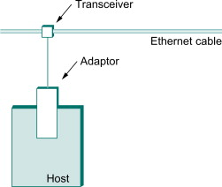
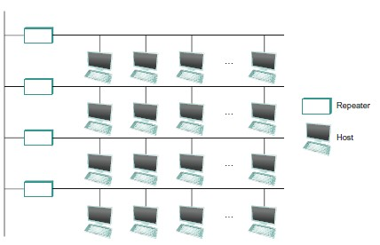
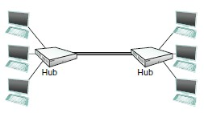
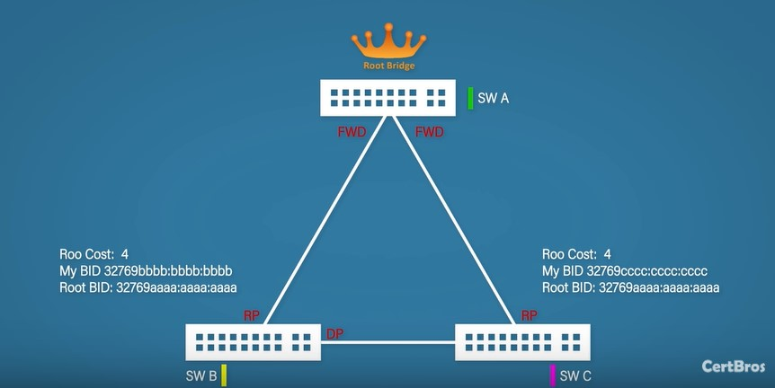

# Ethernet

## Physical properties of Ethernet
- *Ethernet segment*: a cabal (coaxial, or twisted copper pairs, or optical fiber) with length up to 500m, to which hosts can connect to.

    
    
- *repeater*: a device that forward digitals (between Ethernet segments). Repeaters are used to join multiple Ethernet segments and extend the range of an Ethernet. A repeater operates at **layer 1**.  It just **blindly** repeat the signal, without understanding the bits or frames, so the connected segments are within the same collision domain.
    

- *hub*: a multiway repeater, so it also operates at the **physical layer**. 
  
      
    A hub repeats whatever it hears on the one port out all other ports.  
    
    For an Ethernet (no matter it consists of a single Ethernet segment, or a linear sequence of segments connected by repeaters, or multile segments connected by a hub), any signal placed on it by a host is broadcast over the entire network, and repeaters and hubs foward the signal on all outgoing segments. This cause the problem of collision (and the reason why an Ethernet is also called a "collision domain"). The MAC part of Ethernet deals with the collisions.
    
- (Layer 2) switch: aka bridge. A device connecting multiple collision domains, operating at **layer 2**.  

    - Historical issue

        Historically, bridges are used to connect multiple Ethernet segments, while nowadays Ethernet's are deployed in a point-to-point configuration. But whether we call the device a bridge or a switch, and whether you're building an extended LAN or a switched Ethernet, the two behaves in *exactly* the same way.

        In short, switch is the same as bridge. 

    - Motivation

        Consider the situation where you want to interconnect several Ethernets. One possible approach is to put a repeater between them. However, this fails if doing so exceeds the physical limitations of the Ethernet (the physical limitation of a collosion domain is 2500m).  Another possibility is to put a node between the 2 Ethernets and make the node forward frames from one Ethernet to the other. This node would differ from a repeater, which just blindly copies the bit received on one interface to another. Instead, the node would fully implement the Ethernet's collision detection and MAC on each of its interface. In this way, the connected Ethernets remain separate collision domains, and the range restriction of the Ethernet would not apply to the combined pair of Ethernets. In this way, we successfully connect multiple Ethernets.

    - The way a switch/bridge operates
        	1. When any host transmits, the bridge examines its destination MAC address.  
         	2. If the packet is for another LAN, the bridge forwards it (following 
         	3. Otherwise, the bridge drops the packet. 

    - A learning switch: maintaining a **forwarding table** between LANs.  
        1. The forwarding table begins empty; 
        2. When frames are sent on a LAN, the bridge examines the source MAC address and makes entry in the forwarding table; 
        3. If the bridge does not have an entry for the destination address, it broadcasts it to all ports to other segments.  

- Switched ethernet: Historically, each node is in an Ethernet and bridges connect Ethernet together. Nowdasys, hosts are connected to switches and switches connect with each other.  Note that here we are using bridge and switch differently, but they are the same thing.

    Graphically:

    ```
    X: a node, B: bridge, S: switch
    
    Historically, bridges connect multiple Ethernets:
    
    X X   X 		X  X X X
    | |   |			|  | | |
    +-+---+--- B ---+--+-+-+ 
    
    Nowadays, hosts are connected to switches and switches connect switches:
    	X
    	|
    X---S--X	 X
    	|		 |
    	+---S----S---X
    		|	 |
    		|	 X
    	X---S-X
    ```


#### STP (Spanning Tree Protocol)

- Overview

    The learning switches work well until the network has a loop. A loop could exists when multiple administrators are managing the network, or added intentionally for robustness. 

    Consider the network as a cyclic graph, STP finds a spanning tree in it and remove unused edges. In STP, each switch decides the port over which it's wiling/unwilling to forward frames, this could make a switch not participate in forwarding at all. STP is dynamic, prepared to reconfigure into a new spanning tree if any switch fails. 

- Steps in STP:

    1. Elect a root and place root interfaces into forwarding state
    2. each non-root switch selects its root port
    3. remaining links choose a designated port
    4. all other ports are put in to a blocking state

- Roles of ports

    Root ports: the best port to reach the root

    Designated ports: ports with best cost to the root on any other link

    Non-designated port: all other ports that are blocked

- States of ports

    blocking: blocking traffix

    forwarding: sending and receving traffic like normal

Each switch has a BPDU(bridge protocol data unit), with 3 fields: Root cost, my BID, root BID. The switch with the lowest BID becomes the root. In the beginning, each switch thinks itself is the root, then exchanges BPDU with each other. After a root is elected, all ports of the root are in the forwarding state.

Each non-root switch selects the best path to the root, and the ports on those paths are called root ports. Root ports are determined using port costs. The higher the bandwidth, the lower the cost. The root cost is the sum of all **outgoing** ports to the root. The root would send out message (BPDU) with root cost = 0. When a switch receives a BPDU, it adds the port cost of the port on which BPDU is received to the root cost and send it out.


When switchB receives BPDU from root with rootCost = 0, it knows that its G0/2 port has root cost = 4, and send out another BPDU on G0/1, with rootCost = 4. When switchC receives this BPDU from switchB on G0/2, it adds the port cost of G0/2 (which is 4) and knows that the root cost on its G0/2 is 8. A similar process happens on switchC when it receives a message with rootCost = 0 on its G0/1 from the root. The root port is the port with the best cost to the root, so SW B chooses G0/2 as root port, and SW C chooses G0/1 as root port. If in some cases, the root cost is the same on multiple ports of the same switch, some tie breaking is used (detail skipped).

Now we try to select a designated ports for each **link**, from ports that are not root ports. The non-root port with the lowest root cost is selected on each link to be the designated port (some tie breaking possible).



Every port that is not a root port nor a designated gets blocked.


## Ethernet frame format


64-bit preamble: alternating 0s and 1s for synchronization purpose. 
48-bit dest MAC address. 
48-bit src MAC address. 
16-bit packet type: also encodes the length of the frame in bytes. 
Body: >= 46 bytes and <= 1500 bytes. 
From the host's perspective, an Ethernet frame has a 14-byte header: two 6-byte addresses and a 2-byte type field. The sending adaptor attaches the preamble and the receiving adaptor removes it. In other words, preamble is in the physical layer and the layer-2 frame starts AFTER the preamble.  


## MAC for Ethernet  

Carrier-sense, multiple-access, with collision detection (CSMA/CD).  

Transmitter algorithm  
1. When the adaptor has a frame to send and the line is idle, it transmits the frame immediately. If the sender has multiple packets to send, wait for an "interframe gap" (96 bit-time, 9.6 microseconds) before sending the next.

2. When an adaptor has a frame to send and the line is busy, it waits for the line to go idle. When the line gets idle, all waiting adaptors wait for an interframe gap and then transmits.    

    Obviously, collision can occur: when more than one adaptors find that the line is idle, or more than one adaptors have been waiting for a busy line to be idle.  

3. At the moment a sender detects a collision, it transmits a 32-bit jamming sequence and stops transmission.  

    In order for this collision detection mechanism to work, each frame must be at least 64 bytes (14-byte headers + 46-byte payload + 4-byte CRC).  
    Why 64 bytes? Consider the worst case when hosts A and B located at opposite ends of the network. Suppose host A begins transmitting a frame at time t. It takes one link latency (let's denote the latency as d) for the frame to reach host B. Thus, the first bit of A's frame arrives at B at time t+d. Suppose an instant before host A's frame arrives (i.e., B still sees an idle line), host B begins to transmit its own frame. B's frame will immediately collide with A's frame, and this collision will be detected by host B. Host B will send the 32-bit jamming sequence. Unfortunately, host A will not know that the collision occurred until B's frame reaches it, which will happen one link latency later, at time t+2×d. In other words, host A must transmit for 2×d to be sure that it detects all possible collisions. Considering that a maximally configured Ethernet is 2500 m long, and that there may be up to four repeaters between any two hosts, the round-trip delay has been determined to be 51.2 μs, which on a 10-Mbps Ethernet corresponds to 512 bits = 64 bytes.  

4. Once an adaptor detects a collision and stops its transmission, it waits a certain amount of time and tries again. Each time it tries transmitting and fails, the adaptor doubles the amount of time it waits before next try. This strategy is called *exponential backoff*.  
At 1st failure, choose k from {0, 1} then delay for (k * 51.2 micronseconds) + an interface gap; at 2nd failure, choose k from {0, 1, 2, 3} then delay for (k * 51.2 micronseconds) + an interface gap; ...


​    
