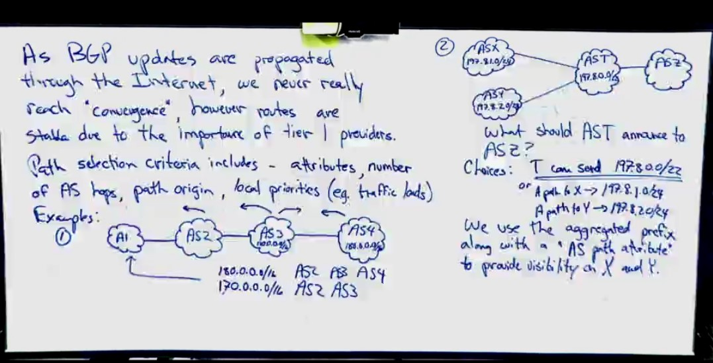
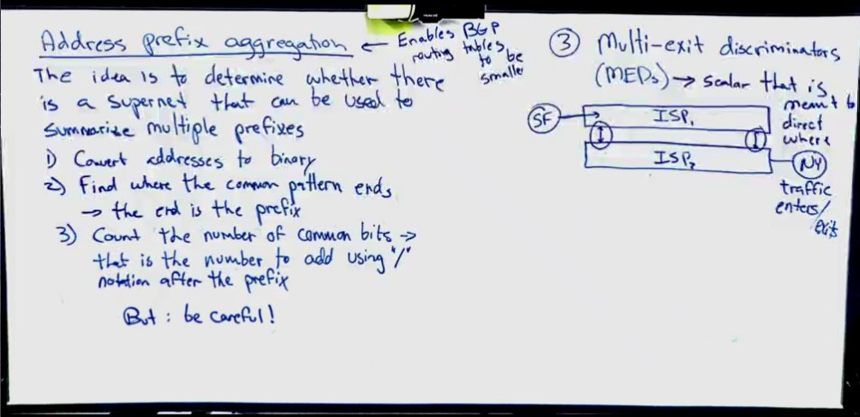

## Inter-domain routing

Intra-domain routing is for establishing forwarding table to move packets toward the **destination subnet** within the domain, while inter-domain routing is for establishing forwarding table to move packets toward the **destination network** (which contains subnets). With intra-domain routing, each router doesn't have to know about all hosts connected to the internet, but it still needs to know about all networks connected to the internet. There're hundreds of thousands of networks in the Internet and the intra-domain routing discussed previously cannot be directly to support the hugh Internet.

Each administratively independent network is called a single *autonomous system* (AS). From this points, we consider the Internet as connected ASs. Another name for autonomous systems is *routing domains*. 

Two scaling issues: (1) minimize the number of network numbers carried around in routing protocols and stored in the forwarding table; (2) address utilization - making sure that IP address space doesn't get consumed too quickly. Previously, we have already seen how the principle of hierarchy is used - supernetting (or CIDR) and subnetting - to improve the scalability of switching. Here we would see further uses of hierarchy to provide scalability. 

#### Scalability Example: Routing area

This is an example of using hierarchy to improve scalability.

OSPF can partition a large routing domain into subdomains called *area*s, which helps OSPF to work for networks with large number of nodes. This enables the domain to grow larger without burdening the routing protocol, or using more complex interdomain routing protocols described later.

An area is a set of routers configured to exchange link-state information with each other. The shaded area is special, called the backbone area. Routers R1, R2, R3 are members of the backbone area, but also members of at least one non-backbone area. A router that is a member of both the backbone area and a non-backbone area is called an *area border router* (ABR). Routing within a single area is exactly as described previously in `3-12 rip ospf.md`. However, LSP from non area border routers don't leave the area. This is the crucial step that improves scalability. For example, R4 in Area 3 never sees LSP from R8 in Area 1. In other words, it doesn't know the detailed topology in other areas.

Any cross-area packet's travel involves 3 parts: travels from source area to backbone area, crosses the backbone, and travels from backbone to the destination area. The area border routers summarize routing information in its own area and make it available in the LSP they send to other areas (so the receivers would believe that the area border routers are directly connected with those nodes). For example, when R1 sends LSP to other areas, it advertises the costs of reaching all subnets in Area 1 as if they are directly connected to itself. Thus, area border routers of other areas would direct packet destined for networks within Area 1 to R1. 

This area mechanism is a tradeoff between scalability and optimality. Since each cross-area packet must go through the backbone area, they might not follow the best path. Usually, scalability is more important than absolute optimality.

### Inter-domain Routing

The basic idea behind autonomous system is to hierarchically aggregate routing information in a large internet, to improve scalability. We can then divide the routing problem into two parts: routing within a single autonomous system, and routing between autonomous systems. As the other name for autonomous system is routing domain, this is also called intra-domain routing and inter-domain routing. In addition to improve scalability, the AS model also decouples intra-domain routing in different domains and so each AS can run its own intra-domain routing protocol.

- policies

    An AS could have preference on routing through its neighbor AS's. This could be typical when commercial contracts are involved. The policy can be quite complicated when the number of neighbor AS's are large.

    Inter-domain routing is designed to support complex policies. Each AS should be able to implement its policy on its own and privately. 

- inter-domain routing protocols

    - Exterior Gateway Protocol (EGP)

        Limit the topology of the Internet as it assumes the Internet as a tree.

    - Border Gateway Protocol (**BGP**)

        BGPv4 in use. Very complex. It makes no assumptions about the topology.

- BGP pre-knowledge

    - Traffic

        Local traffic: traffic that originates and terminates on nodes within an AS.

        Transit traffic: traffic that passes through an AS.

    - AS classification

        - Stub AS (stub: 末节区域)

            Single connection to one other AS. This kind of AS only carries local traffic.

        - Multi-homed AS

            Multiple connections to multiple other AS's but don't carry transit traffic.

        - Transit AS

            Multiple connections to multiple other AS's, carrying both local and transit traffic.

        A stub AS or a multi-homed AS must connect to a transit AS.

    - Goal:

        - Loop-free path to destination domain
        - The path should be compliant with possibly complicated policies

        So intradomain focuses on minimizing the path cost, interdomain focuses on finding loop-free, *policy-compliant* path, which is more complicated.

    - Challenges

        - Scalability: around 700,000 network prefixes, even with CIDR used
        - Autonomous nature of domains: each domain could run its own routing protocol and the way to calculate cost can be different. Thus, interdomain routing advertises on *reachability*.
        - Trust issue: some AS's can be malicious.

- BGP basics

    Each AS has >= 1 *border routers* through which packets enter and leave the AS. They're also known as *gateways*. A border is just an IP router forwarding packets between AS's.

    Each AS must also have >= 1 *BGP speaker*, a router that "speaks" BGP to other BGP speakers in other AS's. It's common, but not required, to have border routers as BGP speakers.

    Unlike distance-vector or link-state routing, BGP advertises *complete paths* as a ***path-vector*** to reach a particular network. The advertisement of complete path is needed to **support policies** and **detect routing loops**. In implementation, BGP advertises network prefixes with ASN sequences. It's essentially telling other AS's the paths itself knows.
    
    Example: Say speaker in AS X sends speaker in AS Y the path to AS Z: `path(X, Z) = X, H1, H2, ..., Z`. If Y selects the path (Y, Z) from X, it will send `path(Y, Z) = Y, path(X, Z)`.
    
    When a router receives a path vector, if it finds itself in the path, it doesn't propagate it.
    
    A given AS only advertises routes that it considers good enough. If a BGP speaker has several choices of several different routes to a destination, it'll choose the best one according to its policies and advertise it. Furthermore, a BGP speaker is not obliged to advertise any route to a destination, even if it has one. This's how an AS can be implemented not to provide transit service.
    
    As link fails and policies changes, BGP speakers need to be able to cancel previously advertised paths. This is done with a form of negative advertisement called *withdrawn route*. So each [BGP update message](https://book.systemsapproach.org/scaling/global.html#fig-bgpup) contains both withdrawn routes and reachable routes.
    
    
    
    BGP runs on TCP's reliable transmission. 
    
- Relationships between AS's

    - Provider-customer. The provider is responsible for connecting the customer to the internet. Common policy for a provider is to advertise all routes it knows to the customer, and advertises routes it learns from customer to everyone.
    - Customer-Provider. The customer wants to get traffic directed to him by the provider, and it wants to send traffic to the rest of the network through the provider. Note that this customer could potentially be a smaller provider to some other customers. So the common policy for a customer is to advertise its own prefixes and routes learned from customers to providers, advertise routes learned from its providers to its customers, but not advertise routes learned from one provider to another provider. The last part is to ensure that the customer wouldn't help carrying transit traffic from one provider to another.
    - Peer. Two providers helping each other without money. The typical policy is to advertise routes learned from my customers to my peer, advertise routes learned from peers to customers, but don't advertise routes from my peer to any provider or vice versa. 

    In this way, we have some structure to the apparently unstructured Internet. At the bottom of the hierarchy we have the stub networks that are customers of one or more providers, and as we move up the hierarchy we see providers who have other providers as their customers. At the top, we have providers who have customers and peers but are not customers of anyone. These providers are known as the *Tier-1* providers.

- Why this helps to build scalable network?

    1. The number of nodes participating in BGP is on the order of number of AS's, instead of the number of networks. Usually, each AS multiple many networks.

    2. Finding a good interdomain route is only about finding a path to the border router of the destination AS, of which there are only a few per AS.

    In this way, the complexity of interdomain routing is on the order of number of AS's, and the complexity of intradomain routing is on the order of the number of networks in a single AS.

#### Integrating Interdomain and Intradomain

In the case of a stub AS that only connects to other autonomous systems at a single point, the border router is the only choice for all routes that are outside the AS. Thus, the border router can inject a *default route* into the intradomain routing protocol, stating that any network that has not been explicitly advertised in the intradomain protocol is reachable through the border router. The default entry is the last one in the forwarding table and matches anything that failed to match a specific entry.

The next step is to have the border routers inject specific routes they learned. Consider, for example, the border router of a provider AS that connects to a customer AS. That router could learn that the network prefix 192.4.54/24 is located inside the customer AS. It could inject a route to that prefix into the routing protocol running **inside the provider AS**. This would be an advertisement of the sort, “I have a link to 192.4.54/24 of cost X.” This would cause other routers in the provider AS to learn that this border router is the place to send packets destined for that prefix.

## CS640

Network is defined by the physical infrastructure, the IP address network prefix, and the Autonomous System Number (ASN), a 32-bit identifier.

Inter-domain routing only cares about network prefix, since the host portion is handled by intra-domain routing.

- Border Gateway Protocol (BGPv4)

    Goal: address limitations of EGP plus additional features to express "policy". Participation in BGP requires that a router act as a "BGP Speaker" for a network. The **BGP speaker**, a single router, establishes BGP sessions with BGP speaker in neighbor AS's. BGP speakers use the BGP protocol to transmit packets between networks.

    BGP speakers exchange the following information: (1) local ASNs and network prefixes; (2) reachability of other networks (this is included by transit AS only); (3) full AS-paths information; (4) policy and preferences; (5) withdrawn (no longer reachable) networks.

    The relationship between AS's: user, service provider, and peer. 

    Challenges:

    1. Size: ~50k AS's, ~500k prefixes. Huge number of prefixes.
    2. Different policies and business objectives.
    3. Flexibility
- BGP operations (by speakers)

    1. Establish session(s) with speakers in neighbors
    2. Exchange active routes
    3. Exchange incremental updates
        1. Prefix becomes unreachable
        2. A better path becomes available
        3. The best path becomes unavailable
        4. Prefix becomes unavailable

- Path-vector routing

    - Why path vector? 
        It prevents count to infinity. When a router receives a path vector. If it finds itself in the path, then it doesn't propagate the message.
    - Enables implementation of policy
        - Attributes can be used
        - forwarding is optional
        - updates can be aggregated

    As BGP updates are propagated through the Internet, we never really reach convergence, however routes are stable due to the importance of tier 1 providers.

    Path selection criteria includes: attributes, number of AS hops, path origin, local priorities (eg., traffic loads).

    

    Example 1 (broading routes):

    AS3: 170.0.4.0/16, AS4: 180.8.0.0/24

    Each AS's BGP speaker would establish session with the BGP speakers in its neighboring network. AS1's table would have:

    170.0.4.0/16 AS2 AS3 

    180.8.0.0/24 AS2 AS3 AS4

    Example 2 (aggregating routes):

    Suppose AS X and Y are customers of AS T. AS T and AS Z are peers.

    AS X: 197.8.1.0/24, AS Y: 197.8.2.0/24, AS T: 197.8.0.0/22.

    Quesion: what should AS T announces to the rest of the network? 

    AS X's and Y's address spaces are portions of AS T's. Choice 1: 197.8.0.0/22; Choice 2: A path to X via 197.8.1.0/24, a path to Y via 197.8.2.0/24. In both cases, the packets are going to be correctly routed, but choice 2 makes the routing table smaller. On the other hand, we like visibility in the network. So the final solution is to use the aggregated prefix, but with an "AS path attribute" to provide visibility to X and Y.

    

- Address prefix aggregation issue

    The idea is to determine whether there's a super net that can be used to summarize multiple prefixes.

    - Convert addresses to binary
    - Find where the common pattern ends. The end is the prefix.
    - Count the number of bits. That's the number of add using "/" notation after prefix.

    But we need to be careful when doing this.

    

    Example:

    197.8.1.0/24 and 197.8.2.0/24. Can we just use 197.8.0.0/22 as an aggregation?

    No! 197.8.0.0/24 and 197.8.3.0 are not present!

- Multi-exit discriminators (MEDs)

    A scalar that's meant to direct where traffic enters/exits. The ISP is not forced to follow this.

    

- Path exploration

    When a link fails, it might take some time for this information to be propagated through the entire network and the BGP speakers advertise this in the withdrawn routes. This called fail overtime.

    