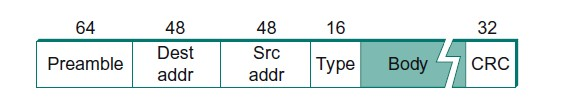
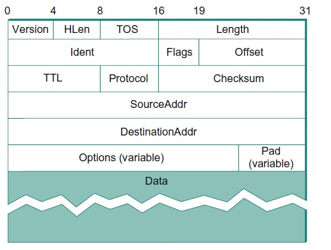

## Overview

- Circuit-switched vs Packet-switched

- Difference between switch and router
    - Switch: within a Local Area Network (LAN), only in layer 2 protocols.
    - Router: between different LANs or even larger networks, only in layer 3 protocols. 

- Forwarding and Routing

    - Packet: data chunk + header
    - Forwarding: transmit a packet towards the destination using forwarding table
    - Routing: the process of establishing forwarding table

- Multiplexing: 

    - time division multiplexing (TDM): allocating time slices
    - frequency division multiplexing (FDM): allocating frequency
    - statistical multiplexing: queueing packets. Possible problem: congestion, packet loss.

- Protocol

    - Definition: specification for interface between modules on different machines
    - Characteristics: data format, rules for information exchange, service implemented

- Internet layered architecture

    ```
    L5: Application -> define interactions with users
    L4: Transport   -> define logical channels between apps and the network
    L3: Network     -> define how packets move (routing + forwarding)
    L2: Link        -> define how hosts access physical layer
    L1: Physical    -> cabal and bit representations
    
                    Data unit    Protocols
    +------------+
    | Application|  message      HTTP, FTP, Email, ...
    +------------+
    | Transport  |  message          TCP, UDP
    +------------+      
    | Network    |  packet               IP
    +------------+
    | Link       |  frame        Ethernet, ...
    +------------+
    | Physical   |  bit          Cabel
    +------------+
    ```

    - Routers use up to network layer, while switches use only up to link layer.
    - Packet and frame are just different names for the same thing.
    - Encapsulation & Decapsulation
      - Encapsulation: Adding headers when data moving down the stack
      - Decapsulation: Removing headers when data moving up the stack

- Performance

    - Bandwidth: amount of bits **transmitted** (by the transmitter) per unit time. The rate at which bit encoding is generated.
    - Latency: time needed to transfer one bit between two nodes. Three parts: propagation delay, queueing delay, transmit delay.

- Error detection & handling

    - Strategy: redundancy
    - Goal: all packets with errors are detected and dropped (recovering is too expensive). The procedure should detect common case errors, while being computationally efficient and minimizing redundant bits needed.


## Physical Layer

- Different physical media with different signal-carrying properties. 
- Bit encodings for copper wire. Non-return to Zero (NRZ), Non-return to Zero Inverted (NRZI), Manchester. 
- Framing: detecting the start/end of packet. Sentinel method. Byte-couting. Clock-based.


## Link Layer

- Concerned with data transfer in the same Local Area Network (LAN). 

- Challenge: Multiple hosts communicate simultaneously using the same channel, i.e., Multiple-access network.

- Solution: **Media Access Control** (MAC). Ethernet, WiFi, etc.

  

### Ethernet

- Physical properties

  - Ethernet segment: a cable with length up to 500m

  - Transceiver: each host has a transceiver, which can transmit and receive bits

  - Repeater: blindly forwards bit between Ethernet segments. Operates at the physical layer

  - Hub: a multi-way repeater. Repeats what it hears on one port to all other ports.

    In a Ethernet, regardless of the number of segments and network topology, data transmitted by any one host reaches all the other hosts, so all these hosts are competing for access to the same link. This is way they are said to be in the same *collision domain*.

    Ethernet segments connected using repeaters/hubs remain in the same collision domain.

  - Switch: connecting multiple collision domains, operating at Link Layer.  When a switch receives a packet, it examines its destination MAC address: if the packet is for another LAN, it forwards it on the corresponding port; otherwise, the packet is dropped. A switch fully implements the Ethernet's collision detection and media access control protocol.

    Ethernet segments connected using switches remain separate collision domains. More on this later.

    A learning switch: maintains a forwarding table between LANs. The forwarding table begins emtpy. When receiving a packet, the switch examines the source MAC address and make entries in the forwarding table. If no entry exists for destination, boardcast on all other ports. 

    The learning switches work unless there's a loop in the network. Spanning Tree Protocol (STP) solves the problem, by finding a spanning tree in the network and remove unused edges. Each switch decides the ports that are used/unused. STP is dynamic, ready to readapt to changed network.

    Historically, nodes form Ethernet segments, and switches connect Ethernet segments. Nowadays, nodes are directly connected to switches and switches are inter-connected with each other: switched Ethernet.

- Frame format

  
  
  MAC address is assigned by hardware manifacture of the network chips.
  
- MAC for Ethernet

  Carrier-sense, multiple-access, with collision detection (CSMA/CD).

  Transmitter algorithm  

  1. When the adaptor has a frame to send and the line is idle, it transmits the frame immediately. If the sender has multiple packets to send, wait for an "interframe gap" (96 bit-time, 9.6 microseconds) in before packets.

  2. When an adaptor has a frame to send and the line is busy, it waits for the line to go idle. When the line gets idle, all waiting adaptors wait for an interframe gap and then transmits. Collision can occur when more than one adaptors thinks the line is idle and transmits at the same time.

  3. At the moment a sender detects a collision (receives packet during transmitting), it transmits a 32-bit jamming sequence and stops transmission.  

     The collision detection mechanism requires each frame to be >= 64 bytes on a 10-Mbps Ethernet (14-byte headers + 46-byte payload + 4-byte CRC). Why 64 bytes? Consider the worst case when hosts A and B located at opposite ends of the network. Suppose host A begins transmitting a frame at time t. It takes one link latency (let's denote the latency as d) for the frame to reach host B. Thus, the first bit of A's frame arrives at B at time t+d. Suppose an instant before host A's frame arrives (i.e., B still sees an idle line), host B begins to transmit its own frame. B's frame will immediately collide with A's frame, and this collision will be detected by host B. Host B will send the 32-bit jamming sequence. Unfortunately, host A will not know that the collision occurred until B's frame reaches it, which will happen one link latency later, at time t+2×d. In other words, host A must transmit for 2×d to be sure that it detects all possible collisions. Considering that a maximally configured Ethernet is 2500 m long, and that there may be up to four repeaters between any two hosts, the round-trip delay has been determined to be 51.2 μs, which on a 10-Mbps Ethernet corresponds to 512 bits = 64 bytes.  

  4. Once an adaptor detects a collision and stops its transmission, it waits a certain amount of time and tries again. Each time it tries transmitting and fails, the adaptor doubles the amount of time it waits before next try. This strategy is called *exponential backoff*.


### Wireless LAN (WLAN) and WiFi

Skipped for now. Doesn't seem like a popular topic for interview.


## Network Layer

- Network layer vs Link layer

  - Linked layer: moving packets between hosts within a LAN
  - Network layer: moving packets between networks (LANs, or larger networks)

- Two issues at Network layer: addressing + routing. 

- Packet format

  

  HLen: header length. Length: Length of packet (header + payload) in bytes. Ident + Flags + Offset: for fragmentation and reassembly. TTL: Time-To-Leave, a hop count to avoid infinite forwarding. The header takes 20 bytes. 

- Fragmentation and Reassembly

  Networks can have different Maximum Transmission Unit (MTU). *Fragmentation* happens at **router** when it receives a packet that it wants to forward to a destination network with MTU smaller than the packet. Fragments of the same packet has the same `Ident`, a `M` flag set for all fragments except for the last one, and `Offset` being the byte position of the start of the fragment (8-byte aligned). Each fragment is a self-contained IP packet with complete header. This allows fragmentation to be repeated. *Reassembly* happens at the receiving host, instead of at router. If some fragments aren't received, the received fragments are discarded.

  Reassembly can be expensive. To avoid fragmentation, *Path MTU discovery* is used to find the minimum MTU on the path prior to sending. The sender sends a packet with "do not fragment" flag. Any router that would have to fragment the packet would drop the packet and sends back a response. Keeps halfing the packet size until finding the suitable one.

- IPv4

  IPv4 address: 32-bit long, organized via "dot notation", separating 8-bit portions. `0.0.0.0` - `255.255.255.255`. An IP address is divided into two parts: *network portion* and *host portion*. 

- IP address allocation

  ```
  Class A:   0 + 7-bit  network + 24-bit host
  Class B:  10 + 14-bit network + 16-bit host
  Class C: 110 + 21-bit network + 8-bit  host
  ```

  The network layer only cares about the network portion of the IP address, to move the packet from source network to destination network. Inefficiency: (1) each physical network requires a unique network number; (2) big gaps between class sizes cause low utilization of IP addresses.

  - Subnetting

    A logical network contains multiple physical networks. Instead of allocating a network number to each physical network, allocates a single IP network number to the logical network and allocates portions to the underlying physical networks, called *subnet*s.

    Each subnet has a *subnet mask*. The subnet number is computed by ANDing the subnet mask with the IP address. When a router wants to forward a packet to a certain IP address, it firstly compute the subnet number of the destination. If within the same subnet, send the packet via link-layer protocol; otherwise, send the packet to a rounter to be forwarded to another subnet. The forwarding table is slightly changed to contain `<Subnet number, subnet mask, next hop>`, instead of `<network number, next hop>`.

    In addition to saving network numbers, subnetting also implicitly solves a problem. Consider a geographically large network. LANs have geographical range restriction and cannot be too large. Subnetting enables us using IP protocol to deliver packets to each subnet, probably physically small.

  - Supernetting/Classless Inter-Domain Routing (CIDR)

    Difference between subnetting and supernetting: subnetting relaxes contraint under classful allocation, while supernetting completely abandons the classful allocation scheme.

    Supernetting assign networks on power of 2 and uses `/x` to represent network numbers.

- Network Address Translation (NAT)

  A "private IP address" that's no globally unique, but unique within some limited scope. This's sufficient if the host communicates only with other hosts within tthe same scope. To communicate with hosts outside the scope, it indirectly does so via a NAT box. The NAT box can translate a private address to a globally unique address assigned to the NAT box. This mechanism allows less globally unique IP address to be allocated.

- IP address allocation

  Statically, or dynamically via Dynamic Host Control Protocol (DHCP). If a host doesn't have an IP address assigned, it sends a request to `255.255.255.255`. The DHCP server would respond with an IP address **via link-layer**.

- IP forwarding

  Each IP packet contains destination IP address. The network portion uniquely identifies a *physical network*. Routers and hosts sharing the same network number is in the same LAN and can communicate via link-layer protocol. The goal is to move the packet from the **source network** to the **destination network** (instead of source host to destination host). 

  Suppose we already have the forwarding table established by the routing process, containing `<Network num, Next Hop>` entries. When a router receives a packet, first examine whether the dst is in the same physical network (by checking network number with the network number of each of its interfaces). If yes, send via link-layer protocol using ARP for address translation (see below). Otherwise, sends on the `next hop` interface. Normally there's also a default router in case no match found.

- Address Resolution Protocol (ARP)

  When the destination host is in the same network as the router, link layer protocol is used to forward the packed to the destination host, and thus MAC address is needed (the packet doesn't contains MAC address since the sender might not know the MAC address of the receiver). 

  ARP enables **each host** to build a table (called *ARP cache*) of `<IP address, MAC address>` mapping. When trying to forward a IP packet, if no mapping is found, the host broadcasts an ARP query to the network. The query contains: sender's IP address, sender's MAC address, and target IP address. The receiver adds the `<sender IP, sender MAC>` mapping to its own ARP cache. If the receiver's IP address matches the query, it responses its MAC address via the link-layer protocol. The sender then adds the mapping to the ARP cache. 

- Three kinds of forwarding tables
  - switch: `<IP, MAC address>`
  - intra-network router (with subnetting): `<Subnet number, subnet mask, interface>`
  - inter-network router: `<Network number, interface>` 

- Internet Control Message Control (ICMP)

  Designed to provide error reporting, usually enabled on routers. 

- Routing

  Process to establish forwarding table at routers (not switches). A *domain* is an internetwork in which all routers are under the same administrative control.

  - Intra-domain routing

    Goal: shortest path between nodes.

    Protocols: 

    - Routing Information Protocol (RIP), based on *distance vector routing* via Bellman-Ford.

      Each node constructs a distance-vector containing distances to all other nodes and distributes the vector to its immediate neighbors, assuming each node knows the cost to its immediate neighbors. 

      When a node receives a distance vector, it recomputes and possibly update its own distance vector. In two cases a node sends distance vector to its neighbors: (1) periodically, (2) after it updates its distance vector or when it notices a link is down.

      The problem with RIP is the *count to infinity* problem: when a link is down, it can take long for the system to stablize. Possible solution is to use smaller value as approximation of infinity, a typical value is 16. This limits RIP to small/medium-sized network.

    - Open Shortest Path First (OSPF), based on *link state routing* via Dijkstra's algorithm.

      The most widely used intra-domain routing protocol. 

      Each node knows the cost to reach its direct neighbors, and tries to disseminate this information throughout the network in *link-state packet*, with *reliable flooding*. 

      Each link-state packet (LSP) contains: (1) ID of the node that created the LSP, (2) a list of directly connected neighbors of that node, with the cost of the link to each one, (3) a sequence number, and (4) a TTL (time to leave) for the packet. Reliable LSP transmission between adjacent routers is made using acknowledgements and retransmissions. 

      When a node X receives a copy of an LSP **originated** (but might be forwarded by some other node Z) from node Y, X checks if it has already stored a copy of an LSP from Y. If no, it stores the LSP. Otherwise, it compares the sequence numbers; If the new LSP has a larger sequence number, i.e., more recent, X replaces the LSP. If the new LSP has a smaller sequence number, it gets discarded. If the received LSP is the newer one, X sends a copy of the LSP to all its neighbors except the neighbor from which the LSP was received, this helps to bring an end to the flooding of LSP. Eventually, the most recent copy of the LSP would reaches all nodes in the network. 

      Each node generates LSPs either **periodically**, or if one of its **immediate neighbors goes down**.

      ```
      N = the set of nodes in the graph
      M = set of nodes incorporated
      l(i, j) = cost with edge between nodes i, j, and l(i, j) = infinity if no edge
      s = source node
      C(n) = cost of path from s to n
      
      Algorithm: 
          M = {s}
          for each n in N - {s}
              C(n) = l(s,n)
      
          while (N != M)
              M = M + {w} where C(w) is the min for all w in (N-M)
              for each n in (N-M):
              	C(n) = MIN(C(n), C(w)+l(w,n))
      ```

      In distributed manner, the algorithm above works as follows. Each router maintains two lists `Tentative` and `Confirmed`. Each list contains entries of the form `(Destination, Cost, NextHop)`. Once a given node has a copy of the LSP **from every other node**, it's able to compute the distance to every other node:

      1. Initialize the `Confirmed` list, `M`, with an entry for myself; this entry has a cost of 0.
      2. For the node just added to the `Confirmed` list, call it node `Next`, `w`, and select its LSP.
      3. For each neighbor (`Neighbor`) of `Next`, calculate the cost (`Cost`) to reach this `Neighbor` as the sum of the cost from myself to `Next` and from `Next` to `Neighbor`, `C(w)+l(w,n)`.
         1. If `Neighbor` is currently on neither the `Confirmed` nor the `Tentative` list, then add `(Neighbor, Cost, NextHop)` to the `Tentative` list, where `NextHop` is the direction I go to reach `Next`.
         2. If `Neighbor` is currently on the `Tentative` list, and the `Cost` is less than the currently listed cost for `Neighbor`, then replace the current entry with `(Neighbor, Cost, NextHop)`, where `NextHop` is the direction I go to reach `Next`, `C(n) = MIN(C(n), C(w)+l(w,n))`.
      4. If the `Tentative` List is empty, stop. Otherwise, move the entry with the minimum cost in `Tentative` to `Confirmed`, and go to step 2.

      Link-state routing algorithm stabilizes quickly, generates little traffic, has **no problem of count to infinity** and responds rapidly to topology changes. The con is that the amount of information stored at each node can be quite large. Why OSPF is preferred over RIP? **Faster, loop-free convergence**.

  - Inter-domain routing

    


