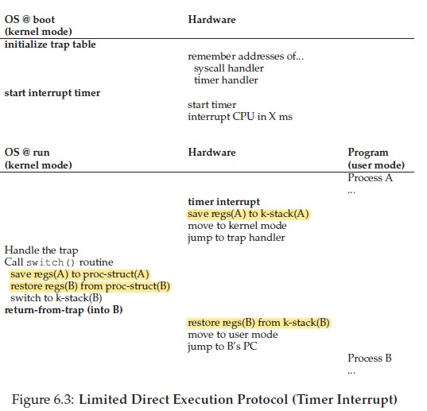
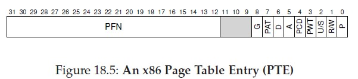
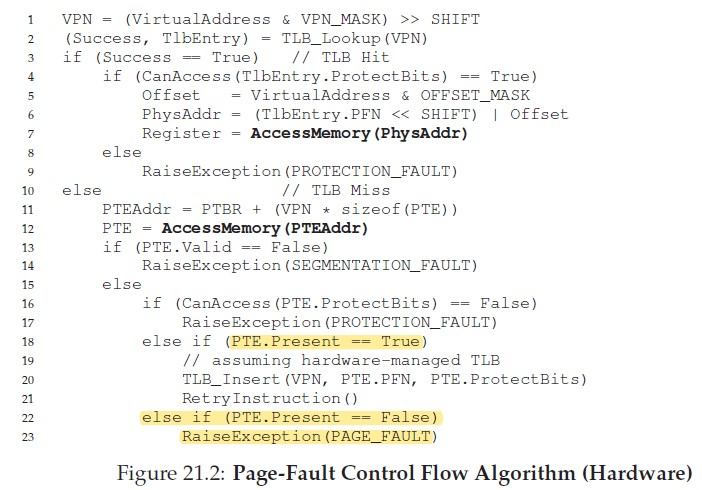
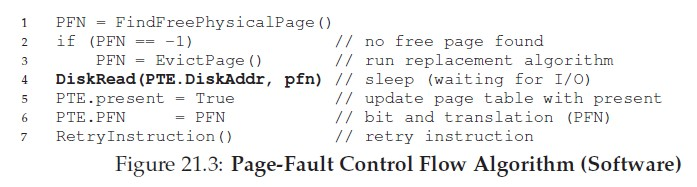

## Part I - Virtualization
### 1. Virtualizing CPU
CPU virtualization = low-level *mechanism* + high-level *policy*  
Mechanism: time-sharing, context switch.
Policy: scheduling policy.  

#### 1.1 Process Abstraction (Chapter 4)
- Process is abstraction provided by OS, which is a running program. At any time, the process can be summarized by its **machine state**.

- A process's machine state: memory, register (including IP, stack pointer, frame pointer, general-purpose registers, etc) , I/O info.  

- Process creation. 
    1. Load code and static data into memory (the address space of the process). Those initially reside on disk, in some executable format
    2. Allocate memory for stack (with paramter to `main`). 
    3. Allocate memory for heap. 
    4. Initialize things like 3 file descriptors (stdin, stdout, stderr), and other I/O setup. 
    5. Create a new PCB in the process list. 

- Process list 

    - Each process can be in one of the 3 states: running, blocked, ready

    - The process list keeps track of: 

        - ready processes
        - running process
        - blocked process (to move to ready when I/O completes)

        For each process, stored information: start address of process memory, size of process memory, state, pid, parent process, whether is killed, open file descriptors `struct file *ofile[NOFILE]`, current directory `struct inode *cwd`, register context, trapframe. 

        The data structure storing the information about a process is called **process control block (PCB)**

        (TODO: For information on start address of process memory, size of process momory, refer to MIT 6.828.)

#### APIs in C (Chapter 5)

- fork: `pid_t fork(void)`

- exec: `int execv(const char *path, char *const argv[])`

    Note that `exec` only returns if error happens. Otherwise, the current process would be replaced by the specified program.

- wait: 

    - `pid_t wait(int *stat_loc);`
    - `pid_t waitpid(pid_t pid, int *stat_loc, int options)`

    If wait succeeds, `wait`/`waitpid` would return the pid of the child process that exits.

The separation of `fork` and `exec` allows performing initialization or bookkeeping before actually running the process. 

#### 1.2 Limited Direct Execution (LDE) (Chapter 6)

Two challenges: performace (switch between processes efficiently), control (retain CPU control).

Solution: use both hardware and software(from os) needed.

When the OS wants to start running a new process: create a PCB in the process list, allocate memory for the process, load program code from disk into memory, locate the entry point of `main()`, set IP to it, and starts running.

- Problem 1: restricted operation of system call. 
    
    The process should be restricted: introduce user mode/kernel mode (by hardware).
    
    To exeucte a system call, the program executes `trap`, which jumps into kernel mode by switching to the kernel process. The kernel do the required work for the proces and calls `return-from-trap`, which returns into the calling process and reduces the priviledge level to user mode.
    
    Register must be saved/restored (to/from kernel stack) **by hardware** during trap/return-from-trap. The CPU would push program counter, flags, general-purpose registers onto a **per-process kernel stack**, and the return-from-trap will pop those values into registers. The kernel stack is used for trapping and returning from trap.
    
    How does the kernel know which code to run for the user process? The kernel sets up a **trap table** at boot time. At boost time, OS informs hardware of locations of different **trap handlers**. 
    
    In summary, two phases in the LDE protocol. Phase 1: at boot time, kernel initialize trap table and informs CPU of different trap handlers. Phase 2: when running a process, kernel sets up a few things (creating PCB, allocate memory) before using return-from-trap to execute a proces. When the process wants to issue a system call, it traps into kernel, kernels does its work, and return control using return-from-trap.
    
- Problem 2: Process Switching 

    - Regain control: cooperative approach v.s. non-cooperative approach.

        Cooperative approach waits for the process to issue system call or take illegal actions. 

        Non-cooperative approach uses timer interrupt. When the interrupt is raised, the current process is halted, and a pre-configured **interrupt handler** of OS runs. So during boot time, kernel sets up the interrupt handler and starts the timer. 

        When the interrupt occurs, the **hardware** must saves registers of the current process onto the kernel stack, so that a subsequent return-from-trap could resume the program correctly. The process is very similar to what happens at explicit system-call trap, so that it's easily restored by the return-from-trap instruction. 

        So the thing to keep in mind is that register saving/restoring **by hardware** happens when: **trap, untrap, interrupt**. This makes since kernel is not aware of when this would happen and you cannot let the kernel code do this. The reason is that once CPU starts reading/executing kernel code, it's changing the value in the registers! So this must be done the hardware, i.e., the CPU.

    - Register saving: user register -> k-stack, kernel registers -> PCB. 

        Once OS regained control, the scheduler makes a decision. If to switch to another process, **context switch** happens. In context switch, OS **saves** some general-purpose register, PC, as well as the kernel stack pointer of the use process to its kernel stack, **restores** the same set of registers for the scheduled process, and **switches** to the kernel stack of the scheduled process. By switching stacks, kernel enters **call to the switch code in the context of the interrupted process** and **returns in the context of the scheduled process** (TODO: recall MIT 6.828). When the OS then executes the return-from-trap instruction, the scheduled process becomes the currently running process and the context switch is complete. 

    - Note that there're 2 types of register saving/restoring happening. When the **interrupt/trap** happens, the **user registers** are **implicitly** saved by the **hardware** to the **kernel stack** of the process. When OS schedules another process and a **context switch** happens, the **kernel registers** are **explicitly** saved by the **software** to the **PCB**.

    

- Side problem: concurrency

    What hapeens when during the interrupt/syscall handler code, another interrupt happens? One (not perfect) solution is for OS to disable interrupt during interrupt handling. 

#### 1.3 Scheduling  (Chapter 7 ~ 10)
- Optimizing turnaround time: SJF, STCF;
- Optimizing response time: RR.  
- Optimizing both: MLFQ.  
- Proportional share: lottery scheduling (undeterministic), stride scheduling (deterministic).  
- Multiprocessor scheduling: concurrency issue (locking overhead), cache coherence, cache affinity, load imbalance.  

### 2. Virtualization Memory 
- Address space: abstraction provided by OS. The process's view of memory. 
- Components in process address space: .text, stack and heap (simplified). The heap grows from lower to higher address, while stack grows from lower to higher address. 
- Goal of virtual memory system: transparency, efficiency, protection.  
- Hardware support: MMU (Memory Mangement Unit).  
- `malloc` and `free` are not system calls. They're library calls built upon some other system calls. (Chapter 14)
- Generic technique: **address translation** (hardware) + **memory management** (os).  At each memory access, hardware converts each virtual address into a physical address. 
- For now, assumes: address space must be contiguous in memory, size of the address space is smaller than the size of physical memory, each address space is of the same size. 
#### Base And Bound (Chapter 15)
- Hardware-based relocation. Requires **two hardware registers within each CPU**, base and bound. Translation done at run time **by MMU**: `physicalAddr = virtualAddr + base`. Address space can be moved after the process has started running, a.k.a *dynamic relocation*.
- When illegal memory access is made, hardware generates exception and let OS takes control. OS exception handler (intalled at boost time) takes action. This is part of LDE (Limited Direct Execution).  
- Summary of hardware support for base&bound: user/kenel mode, base&bound registeres on each CPU, MMU, CPU should generate exception for invalid access and execute exception handler. 
- Summary of OS responsibility for base&bound: 
    - When the process is created, OS needs to find space for its address space. So the OS should maintain a *free list*. 
    - When the process exits, reclaim the memory by putting back to free list.
    - When context switches, base and bound registers need to be saved/restored by OS. Note that this is kernel register and saved by OS itself to PCB.
    - OS can move address space when the process is not currently running. 
    - OS should install memory exception handler at boot time. 


- Base&bound is efficient and imposes protection, but causes **internal fragmentation**.  

#### Segmentation (Chapter 16)

- A generalization of base&bound: Use base & bound pair for each segment *to reduce internal fragmentation*. A segment is a contiguous portion of the address space. With this mechanism, the address space is no longer contigous. This accomodates sparse address spaces.
- Hardware support: a pair of base&bound for each of .text, stack and heap.
- Illegal memory access is called segmentation fault. Notice that the name persisits on OSes without segmentation at all. 
- Higher order bits as segment bits.  Remaining bits as offset into the segment. Special treatment is needed for stack segment translation as stack grows from higher address to lower address. 
- Support code sharing, with *protection bits* added. 
- OS's responsibility for segmentation: all segment registers must be saved/restored at context switch. Free-space management (Chapter 17). Note that this is needed by both library function in virtual address space (like `malloc` in C) and OS in physical memory space.  (TODO: refer to CMU 15-213 MallocLab for great detail.)
- Segmentation reduces internal fragmentation but causes **external fragmentation** as it allocates variable sized segments. Additionally, for segmentation to work well, our model of dividing address space into segments must match the way the underlying data is used (Consider a large heap but only a small portion is frequently used. If the heap is put into one segment, then this's still inefficient).   
- Internal/external fragmentation summary
    - Source of internal fragmentation: large, fixed-sized blocks. 
    - Source of external fragmentation: variable-sized blocks. 
    - Base&bound suffers internal fragmentation, but no external fragmentation
    - Segmentation suffers external fragmentation, but no internal fragmentation
    - Solution: paging (small, fixed-sized blocks).

#### Paging (Chapter 18)
- Variabe-sized pieces: segmentation. Fixed-sized pieces: paging. Each piece in address space is called a *page*, while each piece in physical memory is called a *(page) frame*.  

- Paging: flexibility, simplicity.  

- A **per-process** page table for address translation. 

- Address translation mechanism

    ```
    virtual address = virtual page number (VPN) + offset
    page table entry = <VPN, physical page number (PPN)>
    physical address = mapped PPN + offset
    ```

- Page table can be large (~MB) and is stored in memory. An array of PTEs indexed by VPN.

- Page Table Entry (PTE)

    

    Bit fields:

    - valid bit: translation valid
    - protection bits(R/W): read/write/execute
    - present bit(P): whether the page is in memory or on disk (swapped out to disk)
    - dirty bit(D): whether the page has been modified
    - accessed bit(A): whether the page has been accessed/used 
    - user/supervisor bit(U/S): can be accessed by user or supervisor

- Translation in pseudo-code

    Before doing the address translation, the hardware must find the corresponding PTE. Assume a *page-table base register* contains the physical address of the starting locatino of the page table. Hardware does the following to get PTE address:	

    ```
    VPN     = (VirtualAddress & VPN_MASK) >> SHIFT
    PTEAddr = PageTableBaseRegister + (VPN * sizeof(PTE)) 
    ```

    Then the hardware can fetch the PTE, extract PFN and concatenate with the offset:	

    ```
    PTE = *PTEAddr
    if (PTE.Valid == False):
    	RaiseException(SEGMENTATION_FAULT)
    else if (CanAccess(PTE.ProtectionBits) == False):
    	Raise(PROTECTION_FAULT)
    else:
        PFN = PTE & PFN_MASK
        offset = VirtualAddress & OFFSET_MASK
        PhysAddr = (PFN << SHIFT) | offset
        Register = *PhysAddr
    ```

- Problem 1: Address translation is slow.

    Each instruction fetch would generate two memory references: one to page table to find the physical frame, one to fetch the physical frame into register.

- Problem 2: Page table takes too much memory space.   

#### TLB: Faster Paging Translation (Chapter 19)

Looking up the page table in memory for each memory access is very slow. 

Solution: Hardware support. Table lookaside buffer (TLB). TLB, part of MMU, is a hardware cache of popular virtual-to-physical address translation. It's also called address-translation cache. 

- TLB miss handling
    - Hardware managed TLB

        

        Two kinds of locality involved:

        - spatial locality (each data access is somehow close to previous one)
        - temporal locality (the same data can be re-referenced multiple times)

        The TLB miss is handled by the hardware. When TLB happens, the hardware must do all the work of constructing a new TLB entry. Thus, the hardware needs to know the address of the page table for each process, which is in `%cr3` in Intel x86.

    - Software managed TLB

        The TLB miss is handled by the software. When TLB miss happens, the hardware just raises an exception, pauses current instruction stream, trap into kernel, and jump to the trap handler for TLB miss. 

        - For software-managed TLB, the return-from-trap after TLB miss trap handler is a little different from normal return-from-trap, as it needs to **re-execute** the instruction that causes the TLB miss. So the hardware neesd to set PC differently. 
        - When running TLB miss handling code, OS needs to avoid infinite loop of TLB misses. 

        The software-managed has a advantage of giving more flexibility to OS and makes hardware design simpler. 

- TLB organization

    - Fully-assocaitive: any translation can be anywhere in the TLB and the hardware searches the entire TLB in parallel. A TLB entry looks like:

        ```
        VPN | PFN | other bits
        ```

        TLB commonly has a valid bit, indicating whether the entry has a valid translation. Protection bits are also common to indicate acces level. Dirty bit is also present.

        Note that the valid bit in TLB is different from the valid bit in page table.

- TLB at context switch

    Possible solutions: 

    - mark all entries as invalid on context switch (can be expensive when context switch happens a lot); 
    - add an ASID (address space identifier, similar to PID but with less bits) to each TLB entry to distinguish entries for different processes.   

- Cache replacement policy (discussed later)

#### Smaller Paging Table (Chapter 20)

Possible solutions: 

1. larger page size [Con: internal fragmentation arise]

2. hybrid of segmentation and paging [Con: have to use segmentation]

    The observation is that suppose a process only uses a small portion of the address space, it doesn't have to store PTEs for many unused space. So instead of having a single page table for entire address space, create one page table per logical segment.

    As we're doing segmentation, we still have base&bound register for each logical segment.   Now base points to the **physical address of the page table** of that segment, and the bound indicates the number of entries in the page table.

    Disadvantage: mainly from the disadvantage of segmentation. Inflexibility, external fragmentation.

3. multi-level page table [Con: increased memory access overhead if PTE not in TLB];

    The idea is similar to segmented paging: don't waste space for unused PTEs. 

    The page table is divided into page-sized units. If all PTEs in an entire page of the page table is invalid, don't allocate that page of the page table. Use a **page directory** to keep track of the validity of each page of the page table.

    The page directory contains Page Directory Entries (PDEs). A PDE minimally contains a valid bit and a page frame number. 

    Advantage: 

    - uses less space
    - The page table doesn't have to be contiguous. Only the page directory needs to.

    Disadvantage: higher cost on TLB miss; complexity.

4. Inverted page table. 

    Instead of mapping virtual address to physical address and maintain a per-process page table, we keep a single page table mapping from physical address to virtual address. The entry should store which process is using the page, and the virtual address in the address space. A hash table can be used for efficiency. 

5. storing page table in kernel virtual memory and can be swapped to disk.  

#### Address space > Physical memory (Chapter 21)

Assumptions up to now: address space is very small and fits into physical memory.

Reality: Each address space is greater than physical memory.

Main idea: OS swaps unfrequently used portions of address space to disk. This enables OS to provide the illusion of a very large address space, much larger than the physical memory.

- Swap space

    Reserved space on disk for moving pages between memory and disk. Assume that OS can read from/write to the swap space in page-sized units. To do so, OS must remember the **disk address** of each page being swapped out.

- Page fault.    

    We use a present bit in PTE to indicate whether the page is in memory. If not, a page fault happens. Upon page fault, the OS's page-fault handler is invoked. 

    Note that page fault is handled by the OS page-fault handler for both hardware-managed TLB and software-managed TLB. 

- How does OS remember the disk address of swapped-out page?

    Bits in PTE normally used for PFN can be used to store the info. 

- Control flow (with both TLB and swap)

    

    

- Replacement policy (Chapter 22)

    Evict before full, optimal replacement policy, FIFO, random, LRU, approximating LRU (for better performance).

- Page selection: demand paging, prefetching. 

- Writing technique: clustering. 

- Thrashing handling: admission control.  

#### Other Techniques by VAX/VMS (Chapter 23)
- Map kernel code into process address space to make kernel's life easier.
- Kernel code and data is shared by mapping the same block in physical memory to different virtual memory address.  
- Lazy optimization: demand zeroing, Copy-On-Write (COW).  

